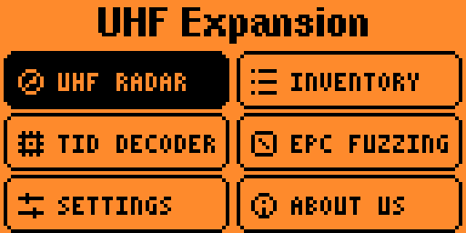
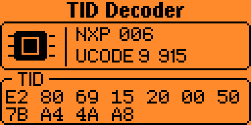
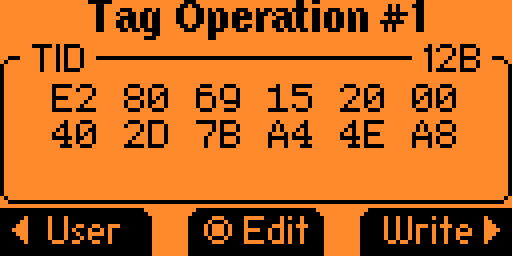
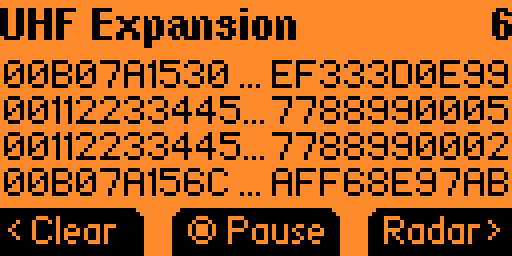
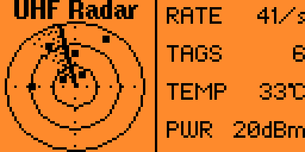
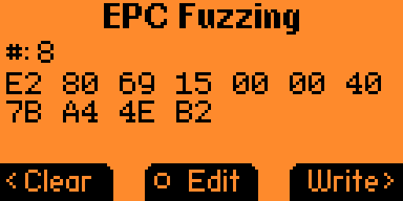

# UHF Expansion

UHF RFID Reader/Writer expansion for Flipper Zero, communicating over UART bridge.


**Available in the official Flipper Apps Catalog:**
[Install UHF Expansion](https://lab.flipper.net/apps/uhf_expansion)

## Features

- **Inventory Scan** — Fast UHF tag scanning with real-time display
- **Feature Menu** — Opens after reader detection with six focused entries
- **TID Decoder** — Automatically pauses on one tag and shows scrollable MDID/model details
- **EPC Fuzzing** — Generates incremental EPC variants with explicit verified writes
- **Persistent Settings** — Configure sound, 0–20 dBm RF power, and a startup tool
- **Paged EPC List** — Browse scanned tags page by page, with truncated preview
- **Tag Details** — View full EPC, RSSI, and PC (Protocol Control) bits for each tag
- **Tag Memory Actions** — Read and write EPC, TID, and User Data on compatible tags
- **Save CSV Records** — Export scanned tags to CSV file on SD card
- **About Page** — Version info and project links

## Screenshots

| Main menu | TID Decoder |
|:--:|:--:|
|  |  |
| **Tag operations** | **Tag Inventory** |
|  |  |
| **UHF Radar** | **EPC Fuzzing** |
|  |  |

## Hardware Setup

### Wiring (UART bridge mode)

| Flipper Zero | UHF Module |
|-------------|------------|
| `13` (TX)   | RX         |
| `14` (RX)   | TX         |
| `16` (C0)   | RST        |
| `8` (3.3V)  | VCC        |
| `18` (GND)  | GND        |

> **Note:** The application uses hardware UART (USART) on pins 13/14 at 115200 baud by default.

> **Hardware reset:** New board revisions should connect the UCM601NC active-low `RST` pin to Flipper `C0` (external pin 16). The application pulses C0 low before its first version probe, preventing the reader from remaining unresponsive after a failed power-on reset. C0 is reserved for reset and is not used as an LPUART fallback.

### Supported Modules

- UCM601 — UHF RFID transceiver module

## Installation

### Official Flipper Apps Catalog (recommended)

Install **UHF Expansion** directly from the
[official Flipper Apps Catalog](https://lab.flipper.net/apps/uhf_expansion).

### Using ufbt

```bash
# Clone the repository
git clone https://github.com/mtoolstec/fz-uhf-expansion.git
cd fz-uhf-expansion

# Build and install
ufbt build
ufbt launch
```

### Manual installation

1. Download the latest `uhf_expansion.fap` from the [Releases](https://github.com/mtoolstec/fz-uhf-expansion/releases) page
2. Copy it to your Flipper Zero's SD card: `SD Card/apps/GPIO/uhf_expansion.fap`
3. Launch from **Apps → GPIO → UHF Expansion**

## Building from Source

Requirements:
- [ufbt](https://pypi.org/project/ufbt/) — Flipper Zero build tool (`pip install ufbt`)

```bash
ufbt build
```

The compiled `.fap` will be at `build/uhf_expansion.fap`.

## Publishing a New Catalog Version

Normal commits only run the build workflow and do not publish a new version.
To publish an update to the official Flipper Apps Catalog:

1. Increase `fap_version` in `application.fam` using the `major.minor` format.
2. Add a matching `vmajor.minor:` section to `CHANGELOG.md`.
3. Commit with the exact subject `release: major.minor` and push to `master`.

For example, a `release: 1.1` commit must contain `fap_version="1.1"` and a
`v1.1:` changelog section. The release workflow builds the app, validates the
Catalog bundle, updates the Catalog fork, and opens the upstream pull request.

## Usage

1. Connect your UHF module as described in [Hardware Setup](#hardware-setup)
2. Open **Apps → GPIO → UHF Expansion**
3. Choose **UHF Radar**, **Tag Inventory**, **TID Decoder**, **EPC Fuzzing**, **Settings**, or **About Us**
4. In UHF Radar or Tag Inventory, press **OK** to start/stop inventory scanning
5. Navigate the tag list with **Up/Down**
6. Press **OK** on a tag to view details
7. Use the submenu to save or clear tag records

## Protocol

The module communicates using a binary protocol over UART (115200 baud, 8N1):

- **Frame start:** `0xA0`
- **Get version:** `0x72`
- **Get output power:** `0x77`
- **Get reader temperature:** `0x7B`
- **Start inventory:** `0x89` / `0x8A`
- **Stop inventory:** `0x8C`

Tag responses include EPC (Electronic Product Code), RSSI, and PC bits.

## Responsible Use

Use this application only with RFID tags and systems you own or are authorized
to test. Follow local radio, privacy, and data-protection requirements.

## License

[MIT License](LICENSE)

## Author

[MTools Tec](https://github.com/mtoolstec)

---

*Built for Flipper Zero — https://flipperzero.one*
