# Flipcraft

A real first-person voxel survival sandbox for the Flipper Zero, rendered in
true 3D on its 128x64 one-bit screen. You walk through a procedurally
generated world, chop trees, dig for coal and iron, smelt ingots and glass,
craft tools at a crafting table, build with placed blocks, stash loot in
chests, tame a wolf and try to outlive creepers and your own dynamite.

Flipcraft is an independent project by ApertureFox Technology, written from
scratch for this device: a software rasterizer with a depth buffer, cached
chunk meshes, traced sun shadows and a world that streams from the SD card
and never has to fit in memory at once.

<p align="center">
  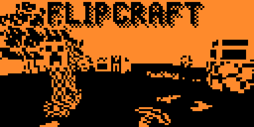
  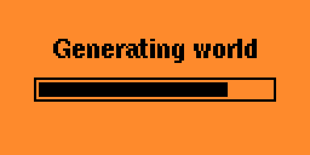
  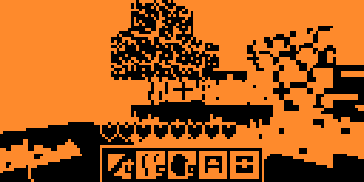
</p>
<p align="center">
  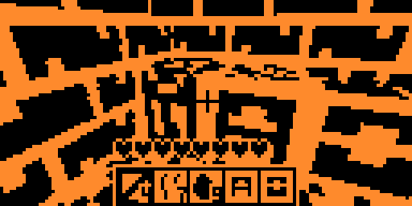
  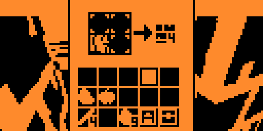
  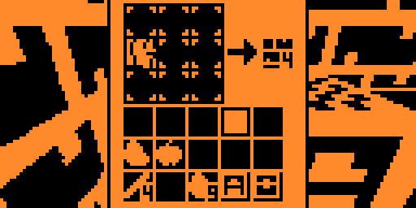
</p>
<p align="center">
  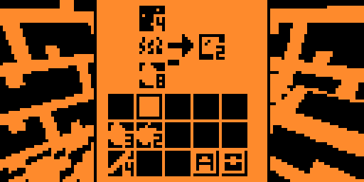
  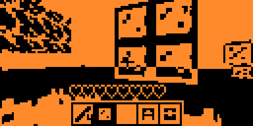
  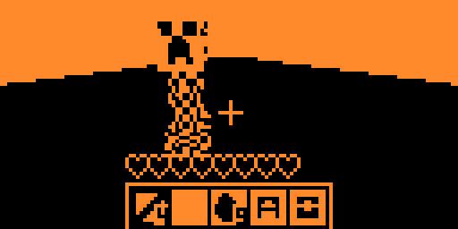
</p>
<p align="center">
  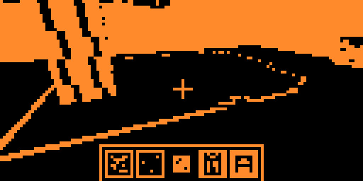
  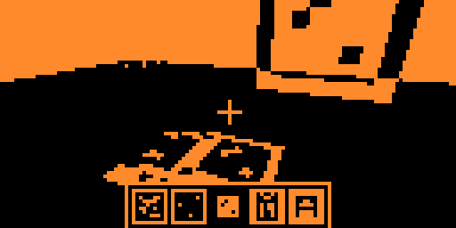
</p>

## Worlds

Every world grows from a text seed in one of four sizes, from 128x128 up to
1024x1024 blocks: forests, deserts, ravines, coal and iron veins, and one
house with a stocked chest somewhere on the map. Terrain is a pure function
of the seed and the coordinates, so the same seed gives the same landscape
at every size, and the generator works tile by tile without ever holding
the whole map.

A world is a single `.fcw` file on the SD card. It holds the blocks, the
player, the inventory and health, and the contents of every chest and
furnace. Any number of worlds can be created, renamed, inspected, given new
settings and deleted from the menu; bundled template worlds ship with the
app.

Each world carries its own settings, chosen at creation and editable later:

| Setting | Options |
|---|---|
| Gamemode | **Survival** - respawn on death. **Hardmode** - death deletes the world. **Creative** - infinite blocks from a picker, no damage, no drops. |
| Mobs | on / off |
| Shaders | Sunlight is traced through the world block by block, glass included. Shadows are drawn as clean outlines, so textures stay exactly as drawn in light and in shade. |
| Draw distance | **Far** renders the whole 3x3 chunk ring around you. **Near** renders only the chunk you stand in and is the lightest mode in RAM and time. |

## Gameplay

- 17 block types: grass, dirt, stone, cobblestone, sand, logs, leaves,
  planks, glass, coal and iron ore, saplings that grow into trees, crafting
  table, furnace, chest and dynamite.
- 3x3 crafting: pickaxes, axes, shovels and swords in wood, stone and iron
  tiers, shears, sticks, planks, glass and the stations themselves. The right
  tool mines its material fast; the wrong one still works, slowly, and
  yields nothing.
- Furnace smelting: iron ore into ingots, sand into glass, fueled by coal,
  wood or wooden tools. Furnaces keep working while you are away, as long as
  you stay in the neighbourhood.
- Chests keep their contents in the world file. A creeper blast destroys a
  chest together with everything in it.
- Eight hearts, fall damage, apples to heal.

### Creatures

Four species share the world. Every creature has two hit points: any sword
kills in one hit, hands or tools in two. A hurt creature flashes for a
second. Creatures are not saved with the world.

- **Sheep** - passive, grazes, flees when hit. Drops an apple.
- **Wolf** - neutral until you hit it, then it bites back for one heart.
  Wolves hunt sheep and creepers on their own; against a creeper a wolf
  bites and springs away, but sometimes lingers too long and the blast takes
  both. Drops an apple.
- **Creeper** - hostile. Stalks you from up to six blocks, freezes next to
  its target, flashes and swells for two seconds, then explodes: a 3x3x3
  crater and about 90% of max health to anyone within 2.5 blocks. Run more
  than four blocks away to disarm it. Drops gunpowder on any death.
- **Bee** - a small neutral flyer that hovers above the ground and drops a
  sapling when killed.

Hold OK on a wild wolf while carrying two apples to tame it. A tamed wolf
never bites you, follows within three blocks and guards you: it still
pounces on sheep and creepers by itself.

### Dynamite

One sand next to one gunpowder in the crafting grid makes a stick of
dynamite. Placed, it is harmless. A short press of OK lights the fuse: it
flashes for about three seconds, falls if unsupported, then explodes like a
creeper. The blast ignites any adjacent dynamite with a short random delay,
so charges can be lined up into a chain reaction. A long press breaks an
unlit charge back into the item.

## Controls

In the world:

| Key | Action |
|---|---|
| Up / Down | walk forward / backward |
| Left / Right | turn |
| OK + Up / Down | look up / down |
| OK + Left / Right | previous / next hotbar slot; in Creative, scroll the block palette |
| OK short | place a block, use the crafting table, furnace or chest, light dynamite, or hit the creature in front of you |
| OK long | mine or break the targeted block; on a wild wolf, tame it |
| Back short | jump |
| Back long | open the inventory; in Creative, the block picker |
| OK + Back | save and quit to the menu |

Creatures are forgiving to aim at: anything near the crosshair counts.
Blocks need the crosshair itself.

In the inventory, crafting, furnace and chest screens:

| Key | Action |
|---|---|
| Arrows | move the cursor |
| OK | pick up a stack, put it down, or take the crafted or smelted output |
| OK + arrow | drop one item from the held stack into each slot you cross |
| Back | close |

In the menu the arrows move, OK confirms and Back returns.

## How it works

The app is split into a tiny resident host and three plugins that are
loaded from the SD card only while needed: the menu, the game and the world
generator. Only the part you are using occupies RAM.

The world is stored in 8x16x8 chunks; the game keeps a 3x3 ring of them
around the player, streaming one chunk per tick from the SD card in file
order and writing edited chunks back during quiet moments. Each resident
chunk is turned into a compact list of visible faces once, and that list is
what a frame draws: no voxel is scanned and no ray is cast per frame. The
rasterizer keeps colour and a 7-bit depth in the same byte, so one 8 KB
buffer is both the framebuffer and the z-buffer, and it samples textures
with perspective correction every eight pixels.

With shaders on, a fixed sun at 50 degrees is traced through the voxel grid
when a chunk is built: five probe rays settle uniform faces, and only faces
the shadow edge cuts through pay for a full 8x8 per-texel mask. Glass stops
light only where its frame has ink. When a block changes, faces whose rays
cannot reach the edited cells keep their previous bake, so an edit costs a
few dozen rays instead of a whole chunk. Shadows are then drawn as the
outline of their silhouette, never as a pattern over the texture.

## Building

The easiest way is [qUnleashed Desktop](https://github.com/DarkFlippers/qUnleashed)
and its Flibler tool (Tools > Flibler): point it at this repository, either
the Git URL or a local folder, pick the firmware channel, and it builds the
`.fap` on your computer when the SDK and toolchain are ready, or on the
build server otherwise, and can install it straight onto the connected
Flipper.

The manual way is the firmware's build tool. Put the repository in
`applications_user/` of an Unleashed (or compatible) firmware tree and run:

```
./fbt fap_flipcraft
```

Either way the `.fap` embeds the three plugins and unpacks them to
`/ext/apps_assets/flipcraft/plugins/` on first launch.

~~`tools/` holds host-side helpers: `hostgen.cpp` generates a world on a PC
with the same code the device uses, `mapview.py` renders a `.fcw` as an
image, and `keyart.py` draws the store key art from a scene the engine could
produce.~~

## Donation

| Service | Remark | QR Code | Link |
|---|---|---|---|
|  **Boosty** | Support the project | <div align="center"><a href="https://boosty.to/apfxtech/donate"></a></div> | [boosty.to/apfxtech/donate](https://boosty.to/apfxtech/donate) |
|  **YooMoney** | RU payments only | <div align="center"><a href="https://yoomoney.ru/fundraise/1IV33POM6H4.260711"></a></div> | [yoomoney.ru/fundraise/1IV33POM6H4.260711](https://yoomoney.ru/fundraise/1IV33POM6H4.260711) |

## License

MIT. Copyright (c) 2026 ApertureFox Technology.
